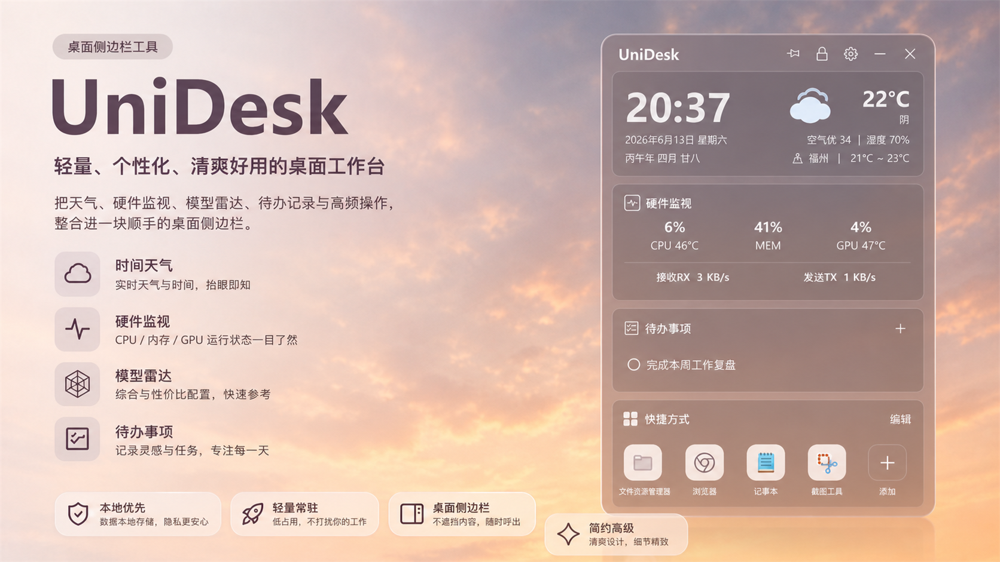
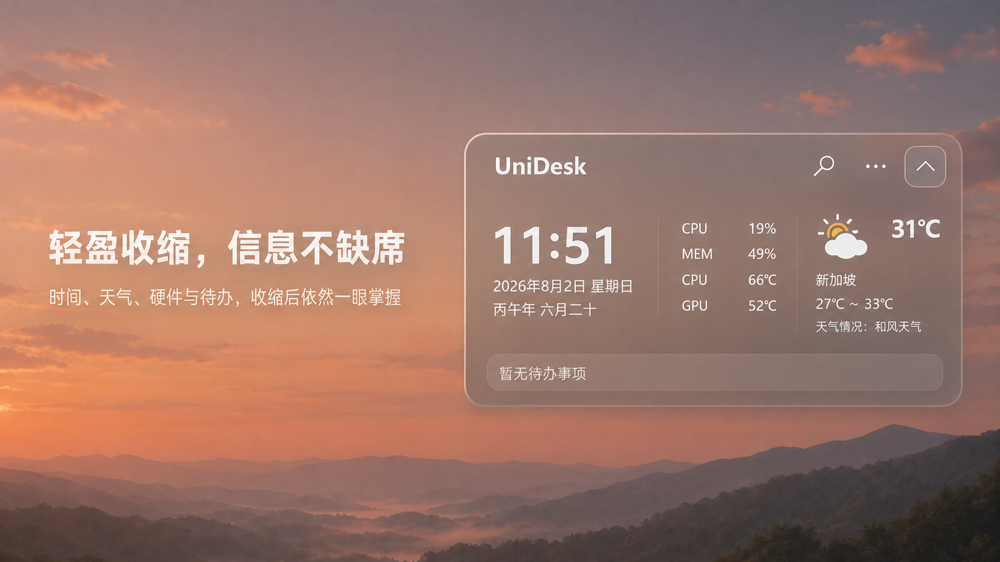

# UniDesk

UniDesk は、Windows デスクトップの端に常駐する軽量でカスタマイズしやすいサイドバーです。時刻と天気、ハードウェア監視、ショートカット、ToDo、クイックメモ、クイックテキストを、ひとつの使いやすいデスクトップ作業スペースにまとめます。

<p align="center">
  <a href="README.md">简体中文</a> ·
  <a href="README.en-US.md">English</a> ·
  日本語 ·
  <a href="README.es-ES.md">Español</a>
</p>



## ✨ 主な機能

### 時刻と天気

- 現在時刻、日付、旧暦情報を表示します。
- 天気、気温、空気質、湿度、都市情報を表示します。
- 旧暦も確認できるデスクトップカレンダーを内蔵しています。

### ハードウェア監視

- CPU、メモリ、GPU 使用率をリアルタイムで確認できます。
- CPU / GPU 温度を表示します。
- PC 全体のアップロード / ダウンロード速度を表示します。
- GPU 温度は、利用可能なドライバーやハードウェア監視情報から可能な限り取得します。取得できない場合は安全に `--` と表示します。

### ショートカット

- よく使うアプリ、ファイル、フォルダーを追加できます。
- デスクトップやエクスプローラーからドラッグして追加できます。
- ショートカットの並び替えに対応しています。
- メインパネルに表示するショートカット数を変更できます。

### ToDo

- ToDo の追加、編集、完了、削除に対応しています。
- 期限時刻と優先度を表示できます。
- 日々のタスク管理に使いやすいよう、データはローカルに保存されます。

### クイックメモ

- 複数のメモを管理できます。
- 自動保存、ピン留め、コピー、削除に対応しています。
- アイデア、下書き、会議メモ、一時的な覚え書きに向いています。

### クイックテキスト

- クリップボード履歴に対応しています。
- よく使う定型文を保存できます。
- ワンクリックでコピーできます。
- 認証コード、パスワード、Token、Cookie などの機密テキストを保存しにくくするフィルターを備えています。

### モジュール管理

- モジュールの表示 / 非表示を切り替えられます。
- モジュールの順序を自由に変更できます。
- 自分の作業習慣に合わせてデスクトップパネルを組み立てられます。

### カスタマイズ

- テーマカラー、透明度、パネル幅、パネル高さ、フォントサイズを調整できます。
- 上部に表示するタイトルを変更できます。
- 最前面表示、ロック、折りたたみ、スタートアップ起動、ショートカット数の設定に対応しています。
- 既定のレイアウトや既定の設定に戻すことができます。

### バックアップと復元

- ローカルデータのバックアップに対応しています。
- ToDo、クイックメモ、クリップボード履歴、定型文を復元できます。
- Windows の再インストールや別 PC への移行後も、よく使うデータを戻しやすくなります。

## 🖼️ プレビュー

### コンパクトダッシュボード

折りたたみ後も時刻、天気、ハードウェア状態、次の ToDo を確認でき、デスクトップに常駐させても邪魔になりません。



### 主要機能


### カスタマイズ


## 🚀 こんな人におすすめ

UniDesk は、デスクトップをすっきり保ちながら、情報確認、ツール起動、ToDo、メモをすばやく扱いたい Windows ユーザーに向いています。

利用シーン：

- 日常のオフィス作業
- 個人の生産性管理
- デスクトップからのクイック起動
- システム状態の確認
- 軽量な ToDo とメモ
- よく使うテキストの素早いコピー

## 📦 インストール

最新機能プレビュー版のインストーラーは [v2.1.0-rc.2](https://github.com/SuperDaddyV/UniDesk/releases/tag/v2.1.0-rc.2) からダウンロードできます。この未署名プレビュー版には「モデルレーダー」と最新のモジュール既定状態が含まれ、初回起動時に Windows SmartScreen の警告が表示される場合があります。現在の安定版は [v2.0.0 安定版（Latest）](https://github.com/SuperDaddyV/UniDesk/releases/latest) です。RC2 のインストーラー ファイル名：

```powershell
UniDesk_Setup_2.1.0.exe
```

インストールまたはアップグレード前に、起動中の UniDesk を終了することをおすすめします。

インストーラーは通常どおりダブルクリックして Windows の UAC 画面で許可してください。標準ユーザーは管理者の資格情報を入力する必要があり、「管理者として実行」を選ぶ必要はありません。メインアプリは任意のローカルドライブ上の安全なフォルダーにインストールでき、上書きインストールでは以前の場所を既定で引き継ぎます。ハードウェアサービス、修復ツール、アンインストーラーは Windows の保護された `Common Program Files\UniDesk` に固定されます。ネットワークパス、ドライブのルート、再解析ポイントを含むパス、UniDesk と確認できない空でないフォルダーは使用できません。

デスクトップショートカットと「完全なハードウェア監視」は既定で選択され、共有 PawnIO ドライバーと `LocalSystem` で動作する読み取り専用 Windows サービスをインストールすることを明示します。`UniDesk.exe` 自体は通常ユーザー権限のままです。完了ページでは UniDesk の起動が既定で選択され、インストール前の通常ユーザーとして自動起動します。このオプションを外した場合やコンポーネントのインストールに失敗した場合も、天気、メモ、ショートカットなどの基本機能は利用できますが、CPU 温度などの低レベル指標を取得できない場合があります。設定から診断のエクスポートと修復を実行できます。

システム要件：

- Microsoft のサポート期間内にある Windows 11 x64
- Windows 10 Enterprise／IoT Enterprise LTSC 2021 以降の x64

Windows 10 version 1903 の API 互換基準を維持します。LTSC 2019 はこの基準未満であり、サポート終了済みの一般向け Windows 10 も正式サポート対象外です。

## 🛠️ ローカルビルド

必要な環境：

- .NET 10 SDK
- サポート対象の Windows 11 または Windows 10 LTSC 開発環境
- Visual Studio 2022、JetBrains Rider、または .NET / WPF に対応した開発環境
- Inno Setup 6（インストーラー作成時のみ必要）

ビルドと実行：

```powershell
git clone https://github.com/SuperDaddyV/UniDesk.git
cd UniDesk

dotnet restore UniDesk.sln
dotnet build UniDesk.sln -c Release
dotnet run --project UniDesk\UniDesk.csproj
```

クリーンなワークツリーからローカルの未署名リリース候補を作成：

```powershell
.\scripts\Build-Release.ps1 -Version 2.1.0
```

このスクリプトは、アプリ、ハードウェアサービス、修復ツールを新しいバージョン別ディレクトリに発行し、その入力だけからインストーラーを作成します。公開用成果物は、手動で起動する GitHub Actions の `Build and sign release candidate` ワークフローで SignPath 署名を行い、`Test-ReleaseReadiness.ps1` に合格する必要があります。このワークフローが GitHub Release を自動作成することはありません。

## 🧰 技術スタック

| 技術 | 用途 |
| --- | --- |
| .NET 10 LTS | アプリケーション実行基盤 |
| WPF | Windows デスクトップ UI |
| SQLite | ローカルデータ保存 |
| CommunityToolkit.Mvvm | UI とデータバインディング補助 |
| LibreHardwareMonitorLib | ハードウェア情報の取得 |
| Hardcodet.NotifyIcon.Wpf | システムトレイ対応 |
| Inno Setup | Windows インストーラー |

## 🔐 データとプライバシー

UniDesk はローカル優先です。設定、ショートカット、ToDo、クイックメモ、クイックテキスト、アイコンキャッシュなどのユーザーデータは、基本的にユーザーの PC に保存されます。

クリップボード履歴には、認証コード、パスワード、Token、Cookie などの機密テキストを誤って保存しにくくするフィルターがあります。この機能はリスクを下げるためのものであり、絶対的な安全を保証するものではありません。機密性の高い内容を扱う場合は、クリップボード履歴を無効にするか、定期的に履歴を削除してください。

## Code signing policy

公開パッケージには[コード署名ポリシー](CODE_SIGNING_POLICY.md)と[プライバシーポリシー](PRIVACY.md)が適用されます。署名候補は公開コミットから構築し、手動承認を受け、ソース版、Authenticode、SHA-256 の検証に合格する必要があります。

Free code signing provided by SignPath.io, certificate by SignPath Foundation.

## 🆕 最近の更新

最近のバージョンでは、次の機能が追加・改善されています。

- モジュールの表示 / 非表示と並び替え。
- ショートカットのドラッグ追加と自由な並び替え。
- 複数メモ、自動保存、ピン留め、コピーに対応したクイックメモ。
- クリップボード履歴、定型文、機密テキストフィルターに対応したクイックテキスト。
- CPU、メモリ、GPU、温度、RX / TX ネットワーク速度を見やすく表示するハードウェア監視レイアウト。
- より多くのハードウェアとドライバー環境で GPU 温度を取得しやすくする改善。
- カスタマイズ設定とメインパネルのスクロール体験の改善。

## 📌 今後の予定

- さらに多くのテーマプリセット。
- より詳しいハードウェア情報。
- より柔軟なモジュール拡張。
- より良いインストールとアップデート体験。

## 🙏 謝辞

UniDesk は [Happyeveryweek/LumiDesk](https://github.com/Happyeveryweek/LumiDesk) をベースに開発されています。デスクトップウィジェット体験のアイデア、基礎、実装を提供してくださった原作者に感謝します。

## 📄 License

このプロジェクトは [MIT License](LICENSE) のもとで公開されています。自己完結型インストーラーに同梱される依存関係、ライセンス本文、入手元は [Third-party notices](THIRD-PARTY-NOTICES.md) を参照してください。
