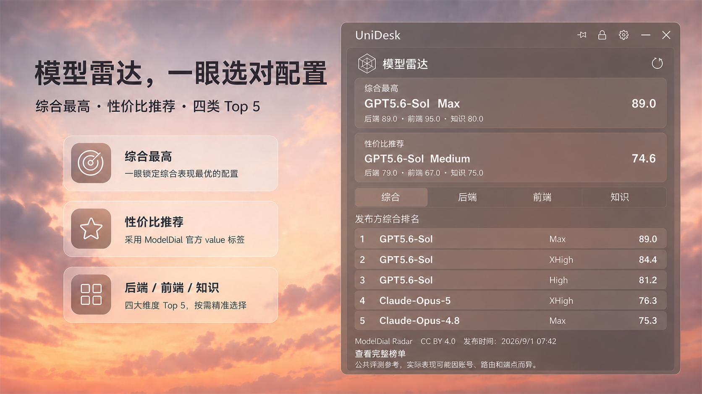

<div align="center">

# UniDesk

<p><strong>把桌面常用信息与高频操作，收进一条轻量侧边栏</strong></p>

时间天气 · 硬件监视 · 模型雷达 · 快捷启动 · 待办 · 便签 · 快捷文本

[](https://github.com/SuperDaddyV/UniDesk/releases/latest)
[](https://github.com/SuperDaddyV/UniDesk/actions/workflows/ci.yml)

[](LICENSE)

**[下载最新版](https://github.com/SuperDaddyV/UniDesk/releases/latest)** ·
[功能概览](#功能概览) ·
[界面一览](#界面一览) ·
[隐私政策](PRIVACY.md) ·
[发布说明](docs/release-unidesk.md)

简体中文 ·
<a href="README.en-US.md">English</a> ·
<a href="README.ja-JP.md">日本語</a> ·
<a href="README.es-ES.md">Español</a>

</div>


UniDesk 是一款面向 Windows 的桌面侧边栏工具。展开时，它把信息查看、任务记录和快捷操作集中到一处；收缩后仍保留时间、天气、硬件状态和下一项待办，适合长期常驻桌面。

## 下载与安装

**[下载 UniDesk v2.2.1（Windows x64）](https://github.com/SuperDaddyV/UniDesk/releases/download/v2.2.1/UniDesk_Setup_2.2.1.exe)**

[查看 v2.2.1 Release](https://github.com/SuperDaddyV/UniDesk/releases/tag/v2.2.1) ·
[SHA256SUMS.txt](https://github.com/SuperDaddyV/UniDesk/releases/download/v2.2.1/SHA256SUMS.txt) ·
[release-manifest.json](https://github.com/SuperDaddyV/UniDesk/releases/download/v2.2.1/release-manifest.json)

> [!NOTE]
> `v2.2.1` 安装包和 UniDesk 一方二进制文件为 `Authenticode: NotSigned`。Windows 可能显示 SmartScreen 或企业策略提示；请从本仓库 Release 下载并核对 SHA-256。

| 项目 | 支持范围 |
| --- | --- |
| 系统 | 仍在 Microsoft 支持周期内的 Windows 11 x64 |
| 长期服务版本 | Windows 10 Enterprise／IoT Enterprise LTSC 2021 或更新版本 x64 |
| 安装包 | `UniDesk_Setup_2.2.1.exe` |
| SHA-256 | 以 Release 同页的 `SHA256SUMS.txt` 为准 |

<details>
<summary><strong>安装路径、UAC 与硬件组件说明</strong></summary>

- 安装或升级前建议先退出正在运行的 UniDesk，然后直接双击安装包并确认 UAC；标准用户需要输入管理员凭据，无需右键选择“以管理员身份运行”。
- 主程序可以安装到本地固定 NTFS／ReFS 磁盘的安全目录；覆盖安装默认沿用上次位置。安装器会拒绝网络路径、可移动磁盘、磁盘根目录、重解析路径和无法确认归属的非空目录。
- “完整硬件监控组件”默认勾选，会安装固定版本 PawnIO 和以 `LocalSystem` 运行的只读硬件服务；`UniDesk.exe` 始终按普通用户权限运行，受保护组件位于 `Common Program Files\UniDesk`。
- 取消硬件组件或组件安装失败不会影响天气、待办、便签和快捷方式等基础功能，但部分底层温度可能显示为 `--`，可稍后在设置中导出诊断并重试修复。
- 项目保留 Windows `10.0.18362` API 兼容基线；LTSC 2019 低于该基线，已停止支持的普通 Windows 10 版本也不属于正式支持范围。

</details>

## 功能概览

| 能力 | 主要内容 |
| --- | --- |
| 信息一览 | 时间、日期、农历、天气、空气质量、湿度和桌面日历 |
| 硬件状态 | CPU／内存／GPU 使用率、CPU／GPU 温度、整机 RX／TX 网速；不可用数据安全显示为 `--` |
| 任务记录 | 待办事项、优先级、时间提醒、多条自动保存便签、本地备份与还原 |
| 快捷操作 | 拖拽添加应用、文件和文件夹，自由排序；剪贴板历史、常用短语和一键复制 |
| 模型雷达 | 综合最高、官方 `value` 性价比推荐，以及综合／后端／前端／知识四类 Top 5 |
| 自由组合 | 模块显示、隐藏与排序，主题配色、透明度、尺寸、字体、置顶、锁定、收缩和开机自启 |

全新安装默认启用时间天气、硬件监视、待办事项和快速便签；快捷方式、快捷文本和模型雷达默认关闭。升级会保留已有模块开关和排序。

<details>
<summary><strong>模型雷达的数据来源与边界</strong></summary>

- 数据来自 [ModelDial Radar](https://modeldial.com/zh-CN/radar) 公开评测，并遵循其 [CC BY 4.0 数据许可](https://modeldial.com/data-license)。
- “性价比推荐”只采用发布方的官方 `value` 标签，UniDesk 不重新计算评分或费用。
- 模块关闭时不发起网络请求；启用后优先读取本地缓存，每 6 小时最多自动检查一次，也可以手动刷新。
- 该模块只提供决策参考，不调用模型、不执行本地评测、不修改模型工具配置，也不代表合作或背书。

</details>

## 界面一览

| 收缩仪表盘 | 核心工作台 |
| :---: | :---: |
| [](images/unidesk-compact-dashboard.png) | [](images/unidesk-features.png) |
| **模型雷达** | **个性化设置** |
| [](images/unidesk-model-radar.png) | [](images/unidesk-customization.png) |

<sub>以上均为静态界面示意，日期、天气、硬件数值和模型榜单不代表当前实时状态；模型雷达截图使用 2026 年 8 月 30 日公开批次。点击图片可查看原图。</sub>

## 数据与隐私

- 设置、快捷方式、待办、便签、快捷文本和图标缓存等主要数据保存在本机。
- 剪贴板历史提供敏感内容过滤，用于降低验证码、密码、Token、Cookie 等内容被误存的风险，但它不是绝对安全保证；处理高敏感内容时应关闭该功能或及时清理记录。
- 天气与自动定位、模型雷达等联网行为及其关闭方式以[隐私政策](PRIVACY.md)为准。

## Code signing policy

公开发布包遵循[代码签名政策](CODE_SIGNING_POLICY.md)。`v2.2.1` 使用单独批准、仅适用于该精确版本的未签名正式版例外，安装包状态为 `Authenticode: NotSigned`；SignPath 签名流程保留给未来版本。

Free code signing provided by SignPath.io, certificate by SignPath Foundation.

## 本地构建

技术栈：`.NET 10 LTS` · `WPF` · `SQLite` · `CommunityToolkit.Mvvm` · `LibreHardwareMonitorLib` · `Inno Setup`

环境要求：受支持的 Windows x64、.NET 10 SDK，以及 Visual Studio 2022、JetBrains Rider 或其它支持 .NET／WPF 的开发环境。

```powershell
git clone https://github.com/SuperDaddyV/UniDesk.git
cd UniDesk

dotnet restore UniDesk.sln
dotnet build UniDesk.sln -c Release
dotnet run --project UniDesk\UniDesk.csproj
```

<details>
<summary><strong>构建本地未签名候选包</strong></summary>

制作安装包还需要 Inno Setup 6。请从干净工作区运行：

```powershell
.\scripts\Build-Release.ps1 -Version 2.2.1
```

公开发布前必须通过未签名发布就绪门禁、人工矩阵和项目所有者批准；构建脚本不会自动创建 GitHub Release。完整规则见[发布说明](docs/release-unidesk.md)。

</details>

## 项目文档

- [版本发布说明](docs/release-unidesk.md)
- [隐私政策](PRIVACY.md)
- [代码签名政策](CODE_SIGNING_POLICY.md)
- [安全政策](SECURITY.md)
- [第三方依赖与许可](THIRD-PARTY-NOTICES.md)

## 致谢与许可

UniDesk 基于 [Happyeveryweek/LumiDesk](https://github.com/Happyeveryweek/LumiDesk) 开发，感谢原作者提供的创意和基础代码。

项目采用 [MIT License](LICENSE)。自包含安装包实际分发的第三方依赖、许可文本和来源见 [Third-party notices](THIRD-PARTY-NOTICES.md)。
